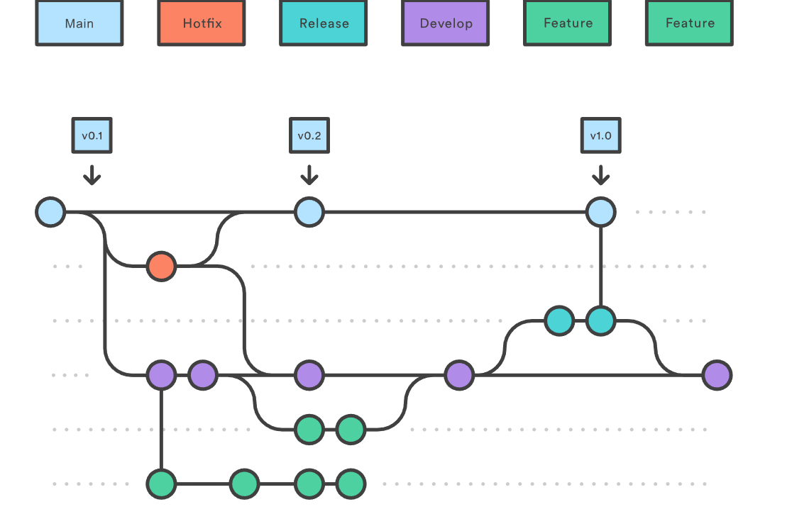

# Báo Cáo Kết Quả Bài Tập Code Game

## 1. Thông Tin Nhóm

**Tên Dự Án:** TypingChef

**Link Dự Án:** [Typing Chef]([https://github.com/HieuGM/TypingChef])

**Thành Viên Nhóm:**
- [Giáp Minh Hiếu]
- [Trần Ngọc Ánh]
- [Mentor: Đặng Huyền Trang]
- [Mentor: Lê Đình Hiệp]


### Mô hình làm việc

Team hoạt động theo mô hình Scrum, sử dụng Linear để quản lý công việc. Các công việc được keep track đầy đủ trên Linear.
- Link linear: [Linear](https://linear.app/typingchef/team/TYP/all)

Mỗi tuần, team sẽ ngồi lại để review công việc đã làm, cùng nhau giải quyết vấn đề và đề xuất giải pháp cho tuần tiếp theo. Sau đó sẽ có buổi demo cho mentor để nhận phản hồi và hướng dẫn.

### Version Control Strategy


Team hoạt động theo Gitflow để quản lý code. Mỗi thành viên sẽ tạo branch từ `develop` để làm việc, các branch đặt theo format `feature/ten-chuc-nang`, sau khi hoàn thành sẽ tạo Pull Request để review code và merge vào develop
- Các nhánh chính:
  - `main`: Chứa code ổn định, đã qua kiểm tra và test kỹ lưỡng
  - `develop`: Chứa code mới nhất, đã qua review và test
  - `feature/`: Các nhánh chứa code đang phát triển, short-live, sau khi hoàn thành sẽ merge vào `develop`. 



Sau mỗi tuần, team sẽ merge `develop` vào `main` để release phiên bản mới.


## 2. Giới Thiệu Dự Án

**Mô tả:** TypingChef là dạng game dùng để luyện gõ và học từ tiếng Anh. Game sẽ có thời gian giới hạn và sẽ tính điểm dựa trên số lượng từ hoàn thành của người chơi. Game rất hợp cho người đang luyện gõ bàn phím hoặc đang học tiếng Anh.

## 3. Các Chức Năng Chính

- Gõ 1 chữ cái bất kỳ để bắt đầu
- Hệ thống tự nhận diện xem người chơi đang gõ chữ nào dựa vào chữ cái đầu tiên
- Hiển thị gõ đúng/sai
- Hiển thị điểm số của người chơi sau khi kết thúc
- Nhấn space để replay

## 4. Công nghệ

### 4.1. Công Nghệ Sử Dụng
- Java
- LibGDX
- Gradle
- Tiled Map


### 4.2 Cấu trúc dự án
```
├───.gradle
├───.idea
├───assets
│   ├───character_actions
│   └───map asset
├───build
│   └───reports
├───core
│   ├───build
│   │   ├───classes
│   │   │   └───java
│   │   │       └───main
│   │   │           └───com
│   │   │               └───typingchef
│   │   │                   ├───controllers
│   │   │                   ├───models
│   │   │                   │   ├───entities
│   │   │                   │   └───systems
│   │   │                   ├───utils
│   │   │                   └───views
│   │   │                       ├───animations
│   │   │                       ├───components
│   │   │                       └───screens
│   │   ├───generated
│   │   ├───libs
│   │   └───tmp
│   └───src
│       └───main
│           └───java
│               └───com
│                   └───typingchef
│                       ├───controllers
│                       ├───models
│                       │   ├───entities
│                       │   └───systems
│                       ├───utils
│                       └───views
│                           ├───animations
│                           ├───components
│                           └───screens
├───gradle
│   └───wrapper
└───lwjgl3
    ├───build
    │   ├───classes
    │   │   └───java
    │   │       └───main
    │   │           └───com
    │   │               └───hieugm
    │   │                   └───typingchef
    │   │                       └───lwjgl3
    │   ├───generated
    │   ├───libs
    │   ├───resources
    │   │   ├───character_actions
    │   │   └───map asset
    │   └───tmp
    ├───icons
    └───src
        └───main
            ├───java
            │   └───com
            │       └───hieugm
            │           └───typingchef
            │               └───lwjgl3
            └───resources
```

Diễn giải:
- **assets:** Chứa các tài nguyên như hình ảnh, âm thanh
- **core:** Chứa các class chính của game như model, view, controller
- **lw3jgl3** Chứa các class để chạy trên các nền tảng desktop


## 5. Ảnh và Video Demo

**Ảnh Demo:**


**Video Demo:**
[Video Link](https://youtu.be/XFw67Vdwevo)


## 6. Các Vấn Đề Gặp Phải

### Vấn Đề 1: [Mô tả vấn đề]
**Ví dụ:** Chưa chia ra được vấn đề để giải quyết, dẫn tới khi merge bị conflict

### Hành Động Để Giải Quyết

**Giải pháp:** Phân chia công việc rõ ràng, cụ thể, không động vào code cũ/code trong phần của nhau để không xảy ra conflict

### Kết Quả

- Cải thiện khá rõ ràng và không gặp vấn đề này nữa

### Vấn Đề 2: [Mô tả vấn đề]
**Ví dụ:** Lỗi sinh từ xảy ra khá nhiều


### Hành Động Để Giải Quyết

**Giải pháp:** Sử dụng logic random sinh từ, chọn bể từ hợp lý

### Kết Quả

- Không bị trùng từ nữa

### Vấn Đề 3: [Mô tả vấn đề]
**Ví dụ:** Lỗi phóng to đen màn hình


### Hành Động Để Giải Quyết

**Giải pháp:** Sử dụng các tỉ lệ thay vì hằng số

### Kết Quả

- Phóng to vẫn nhìn được nhưng bảng thông báo hơi vỡ

## 7. Kết Luận

**Kết quả đạt được:** [Game chạy khá ổn, trơn tru, mặc dù có hơi vỡ chút hình ảnh khi phóng to]

**Hướng phát triển tiếp theo:** [Sẽ cập nhật thêm các level, trạm di chuyển khác nhau]